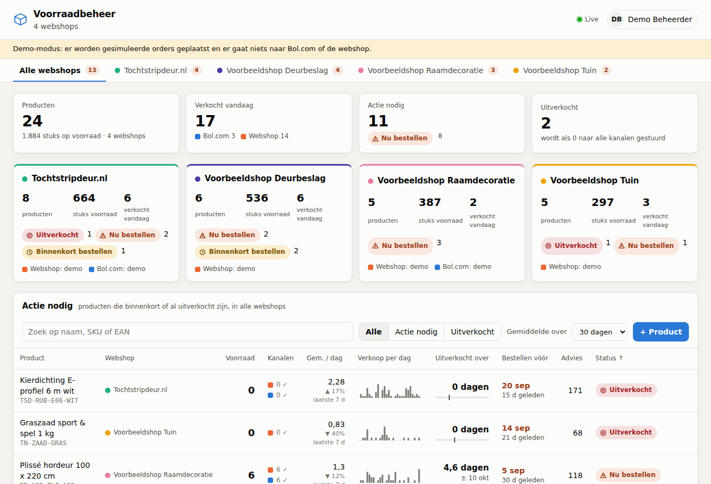
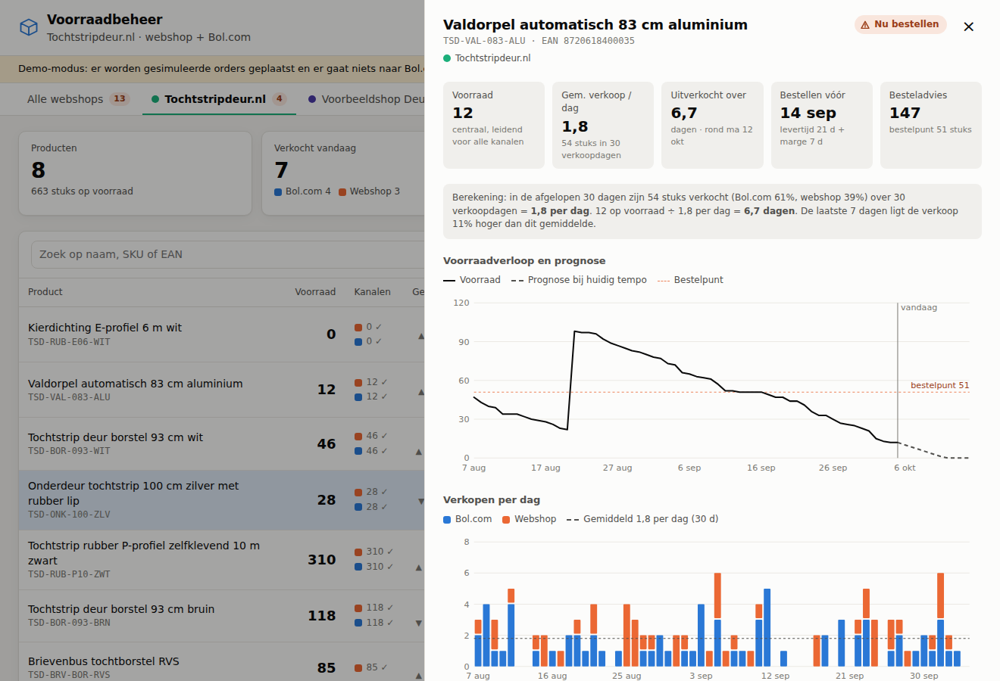
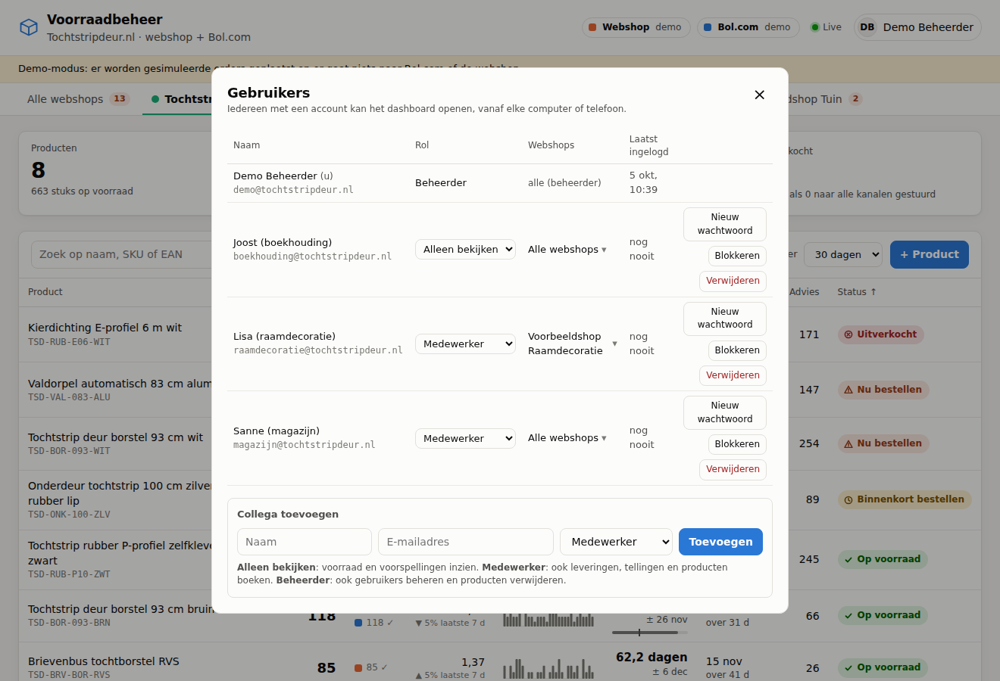

# Voorraadbeheer tochtstripdeur.nl

Centraal voorraadbeheer voor **Bol.com** en de **eigen webshop (WooCommerce)**:

- **Real-time synchronisatie** – verkoopt u een artikel via Bol.com, dan wordt de voorraad in de webshop direct aangepast, en omgekeerd.
- **Eén centrale voorraad** – het systeem is leidend; beide kanalen krijgen altijd dezelfde, actuele voorraad.
- **Uitverkoopvoorspelling** – per product: gemiddelde verkoop per dag, over hoeveel dagen het uitverkocht is, uiterste besteldatum en een besteladvies.
- **Live dashboard** – voorraad, synchronisatiestatus per kanaal, grafieken en een live activiteitenlog.
- **Voor het hele team** – eigen login per collega met een rol; bij elke mutatie staat wie hem heeft geboekt.
- **24/7 online** – draait op een server (niet op een laptop), met automatische herstart en dagelijkse back-up.

Geen externe afhankelijkheden: alleen Node.js 22.13 of hoger (met ingebouwde SQLite).



## Snel proberen (demo)

```bash
npm run demo
```

Open <http://localhost:3000> en log in met `demo@tochtstripdeur.nl` / `demo-wachtwoord` (staat ook op de inlogpagina). De demo vult 8 voorbeeldproducten met 90 dagen verkoophistorie en plaatst elke ~12 seconden een gesimuleerde order op Bol.com of de webshop, zodat u de live-synchronisatie ziet. Er wordt niets naar Bol.com of de webshop gestuurd.

## Hoe het werkt

```
 Bol.com  ──(orders ophalen, elke 60 s)──┐                ┌──(voorraad PUT)──▶ Bol.com
                                         ▼                │
                               Centrale voorraad (SQLite) ─┤  wachtrij met automatische herhaling
                                         ▲                │
 Webshop  ──(webhook, direct)────────────┘                └──(voorraad PUT)──▶ Webshop
          ──(vangnet: elke 5 min)
```

1. **Order binnen.** De webshop meldt nieuwe en gewijzigde orders direct via een webhook (met een vangnet-controle elke 5 minuten). Bol.com heeft geen order-webhooks; het systeem vraagt daarom elke 60 seconden nieuwe en gewijzigde orders op.
2. **Boeken in het grootboek.** Elke orderregel wordt precies één keer geboekt (dubbele meldingen worden herkend). Wordt een order geannuleerd, dan komt de voorraad automatisch terug.
3. **Doorzetten naar alle kanalen.** De nieuwe voorraad wordt naar Bol.com én de webshop gestuurd. Lukt dat niet (storing, rate limit), dan probeert het systeem het automatisch opnieuw met oplopende wachttijd. Meerdere verkopen kort na elkaar leveren één update op met de laatste stand.

Welke orders tellen mee?

| Kanaal | Telt als verkocht | Komt terug op voorraad |
|---|---|---|
| Webshop | status *In behandeling*, *In de wacht*, *Afgerond* | *Geannuleerd*, *Mislukt*, *In afwachting van betaling* (en *Terugbetaald* als `WOO_RESTOCK_ON_REFUND=true`) |
| Bol.com | elke (FBR-)orderregel: aantal − geannuleerd aantal | geannuleerde (deel)aantallen |

## De voorspelling

Voor elk product, over de gekozen periode (standaard 30 dagen, in te stellen op 7–90 dagen):

| | Berekening |
|---|---|
| **Gemiddelde verkoop per dag** | verkochte stuks (Bol.com + webshop) ÷ verkoopdagen |
| **Uitverkocht over** | huidige voorraad ÷ gemiddelde verkoop per dag |
| **Verwachte uitverkoopdatum** | vandaag + "uitverkocht over" |
| **Bestelpunt** | gemiddelde per dag × (levertijd + veiligheidsmarge) |
| **Bestellen vóór** | uitverkoopdatum − levertijd − veiligheidsmarge |
| **Besteladvies** | gemiddelde per dag × (levertijd + marge + 60 dagen) − voorraad |

- **Verkoopdagen**: dagen waarop het product uitverkocht was, tellen niet mee – anders lijkt een product langzamer te verkopen dan het doet. Nieuwe producten worden gemiddeld over de dagen dat ze bestaan (minimaal 7).
- **Status**: *Uitverkocht* (voorraad 0), *Nu bestellen* (uitverkocht binnen de levertijd), *Binnenkort bestellen* (binnen levertijd + marge), *Op voorraad*.
- **Trend**: de verkoop van de laatste 7 dagen vergeleken met het gemiddelde, zodat u ziet of een product aantrekt (bijv. in het stookseizoen).
- Levertijd en veiligheidsmarge stelt u per product in.



## Toegang voor collega's

Iedereen logt in met een eigen e-mailadres en wachtwoord, vanaf elke computer, tablet of telefoon.

| Rol | Mag |
|---|---|
| **Alleen bekijken** | voorraad, voorspellingen, grafieken en mutaties inzien |
| **Medewerker** | ook leveringen, voorraadtellingen en productgegevens boeken |
| **Beheerder** | ook collega's toevoegen/blokkeren, wachtwoorden resetten en producten verwijderen |

- **Eerste beheerder**: zet `ADMIN_EMAIL`, `ADMIN_NAME` en `ADMIN_PASSWORD` in `.env`; het account wordt bij de eerste start aangemaakt.
- **Collega toevoegen**: menu rechtsboven → *Gebruikers beheren* → naam, e-mail en rol. U krijgt een tijdelijk wachtwoord om door te geven; de collega wijzigt het via *Mijn account*.
- **Iemand vertrekt**: *Blokkeren* – de toegang stopt direct, ook op apparaten waar diegene nog ingelogd was. Eerder geboekte mutaties blijven bewaard.
- **Wachtwoord vergeten**: een beheerder klikt *Nieuw wachtwoord*. Is de enige beheerder het wachtwoord kwijt: `npm run gebruiker -- wachtwoord <e-mail>` op de server.



Beveiliging: wachtwoorden worden versleuteld (scrypt) opgeslagen, sessies lopen via een beveiligde cookie (30 dagen), na 8 foute pogingen volgt een pauze van 15 minuten, en verzoeken vanaf andere websites worden geweigerd.

## 24/7 online: hosting

Het systeem moet op een server draaien die altijd aan staat – niet op een laptop. Dan blijven de synchronisatie en het dashboard werken, ook 's nachts en in het weekend. De server moet via **HTTPS** bereikbaar zijn (bijv. `https://voorraad.tochtstripdeur.nl`), omdat WooCommerce daar zijn meldingen naartoe stuurt.

Wat er voor continu gebruik al in zit:

- **Automatisch herstarten** na een storing of herstart van de server (Docker `restart: unless-stopped` + health check).
- **Niets gemist na uitval**: gemiste Bol.com-orders worden per dag opgehaald, gemiste webshoporders via de vangnet-controle, en voorraadupdates die nog in de wachtrij stonden worden alsnog verstuurd.
- **Dagelijkse back-up** van de database (standaard 14 dagen bewaard, in `data/backups`, bij Docker in het volume onder `/data/backups`).

### Bestaande VPS met Plesk (bijv. Snel.com)

Draait de webshop al op een VPS met Plesk? Dan kan het voorraadbeheer daar naast de webshop draaien, op een eigen subdomein en begrensd in geheugen en processorkracht. Volg **[docs/installatie-plesk.md](docs/installatie-plesk.md)**; daarin staat ook een kant-en-klaar bericht voor de support van een managed VPS.

### Optie A: eigen server (VPS) met Docker – aanbevolen

Een kleine VPS in Nederland/Duitsland (bijv. TransIP, Hetzner, DigitalOcean Amsterdam; ± €5–10 per maand, 1 GB geheugen is ruim voldoende).

1. Maak een VPS aan met Ubuntu en installeer Docker (`curl -fsSL https://get.docker.com | sh`).
2. Laat een subdomein (bijv. `voorraad.tochtstripdeur.nl`) met een **A-record** naar het IP-adres van de server wijzen (bij uw domeinbeheerder).
3. Zet de code op de server, maak `.env` aan (`cp .env.example .env`) en vul `DOMAIN`, de beheerder en de koppelingen in.
4. Start: `docker compose up -d --build`

Caddy (zit in `docker-compose.yml`) regelt automatisch een gratis HTTPS-certificaat. Bijwerken naar een nieuwe versie: code verversen en opnieuw `docker compose up -d --build`.

### Optie B: hostingplatform

Platforms zoals Render, Railway of Fly.io kunnen de meegeleverde `Dockerfile` direct vanuit GitHub draaien, inclusief HTTPS. Let op: kies een **EU-regio** en koppel een **persistente schijf** op `/data` (anders gaat de database verloren bij een herstart), en draai precies **één** instantie.

Gewone webhosting (waar de WordPress-webshop op staat) is meestal niet geschikt, omdat daar geen programma continu kan draaien.

### Zonder Docker

```bash
cp .env.example .env      # en vul de gegevens in
npm start                 # laat dit draaien via bijv. systemd of pm2, achter een HTTPS-proxy (TRUST_PROXY=true)
```

## Installatie

### 1. Server

Zie [24/7 online: hosting](#247-online-hosting). Vul in `.env` in elk geval de eerste beheerder in (`ADMIN_EMAIL`, `ADMIN_NAME`, `ADMIN_PASSWORD`).

### 2. Bol.com koppelen

1. Partnerplatform → **Instellingen → API-instellingen** → Retailer API → credentials aanmaken.
2. Zet `BOL_CLIENT_ID` en `BOL_CLIENT_SECRET` in `.env`.
3. Producten worden aan Bol-orders gekoppeld via de **EAN**. Het Bol **offer-ID** (nodig om de voorraad bij te werken) wordt bij de eerste Bol-order automatisch opgehaald; u kunt het ook zelf invullen bij het product.

### 3. WooCommerce koppelen

1. WooCommerce → **Instellingen → Geavanceerd → REST API** → sleutel toevoegen met rechten **Lezen/Schrijven**. Zet de sleutels in `WOO_CONSUMER_KEY` / `WOO_CONSUMER_SECRET`.
2. WooCommerce → **Instellingen → Geavanceerd → Webhooks** → maak er twee aan:
   - Onderwerp **Order aangemaakt** en **Order bijgewerkt**
   - Aflever-URL: `https://<uw-server>/webhooks/woocommerce`
   - Geheim: dezelfde waarde als `WOO_WEBHOOK_SECRET`
   - API-versie: WP REST API Integration v3
3. Zorg dat bij elk product in WooCommerce **"Voorraad beheren"** aan staat en dat de **SKU** is ingevuld (wordt ook automatisch aangezet bij de eerste synchronisatie).

### 4. Producten inlezen en live gaan

```bash
# Optie A: alle producten (incl. variaties) uit de webshop overnemen, gekoppeld op SKU
npm run import -- --woocommerce

# Optie B: een CSV-bestand (zie voorbeeld-producten.csv)
npm run import -- producten.csv
```

Vul daarna per product de **EAN** (voor Bol.com), **levertijd** en **veiligheidsmarge** in – via het dashboard of de CSV. Controleer de voorraadstanden (een telling kan via het dashboard) en start de server: vanaf dat moment is deze voorraad leidend en wordt hij naar beide kanalen gestuurd.

```bash
# Optioneel: verkoophistorie van de afgelopen 90 dagen inlezen, zodat de voorspelling
# direct klopt. Dit verandert de voorraad niet.
npm run backfill
```

Orders die vóór het live-gaan zijn geplaatst, tellen alleen mee als historie voor de voorspelling – ze zitten immers al in de ingevoerde voorraad.

## Dagelijks gebruik

- **Levering ontvangen**: open het product → *Levering ontvangen* → aantal. De nieuwe voorraad gaat direct naar beide kanalen.
- **Voorraadtelling / correctie**: open het product → *Voorraadtelling*; het verschil wordt als correctie geboekt.
- **Kanaal loopt achter?** De kolom *Kanalen* toont per kanaal de laatst doorgestuurde voorraad (✓ = gelijk aan de centrale voorraad). Met *Voorraad opnieuw naar kanalen sturen* forceert u een update.
- Elke mutatie staat met datum, kanaal en ordernummer in de mutatielijst van het product.

## CSV-kolommen

`sku` (verplicht), `name`, `ean`, `stock`, `lead_time_days`, `safety_days`, `woo_product_id`, `woo_variation_id`, `bol_offer_id`. Scheidingsteken `;` of `,`. Bestaande producten worden bijgewerkt; een ingevulde `stock` wordt als voorraadtelling geboekt.

## Goed om te weten

- **Webshopplatform**: deze koppeling gaat uit van **WooCommerce**. Draait tochtstripdeur.nl op een ander platform (bijv. Shopify, Lightspeed of CCV Shop), dan hoeft alleen `src/channels/woocommerce.js` te worden vervangen door een koppeling met dezelfde functies (`pushStock`, orders boeken).
- **Bol.com**: alleen **FBR**-orders (zelf verzenden) tellen standaard mee; FBB-voorraad ligt bij Bol zelf. Bol accepteert een voorraad van maximaal 999 per aanbieding.
- **Bol.com-vertraging**: omdat Bol.com geen order-webhooks biedt, duurt het maximaal ~60 seconden (`BOL_POLL_INTERVAL_SECONDS`) voordat een Bol-verkoop in de webshop zichtbaar is. Webshopverkopen staan binnen enkele seconden op Bol.com.
- **Overselling**: verkopen beide kanalen tegelijk het laatste stuk, dan kan de voorraad negatief worden; het dashboard toont dit in rood en beide kanalen krijgen 0.
- **Retouren** worden niet automatisch teruggeboekt (de staat van het artikel is onbekend); boek ze via *Levering ontvangen* of een telling.

## Ontwikkeling

```bash
npm test          # unit- en integratietests (Bol.com en WooCommerce API's gesimuleerd)
```

| Map | Inhoud |
|---|---|
| `src/inventory.js` | centraal grootboek: verkopen, annuleringen, ontvangsten, tellingen |
| `src/forecast.js` | voorspelling (gemiddelde verkoop, dagen tot uitverkocht, besteladvies) |
| `src/sync.js` | wachtrij die voorraad naar de kanalen stuurt, met herhaalpogingen |
| `src/channels/bol.js` | Bol.com Retailer API (orders ophalen, voorraad bijwerken) |
| `src/channels/woocommerce.js` | WooCommerce REST API + webhooks |
| `src/server.js` | HTTP-API, login, webhook-endpoint en live-updates (Server-Sent Events) |
| `src/auth.js` | gebruikers, rollen, wachtwoorden en sessies |
| `src/backup.js` | dagelijkse back-up van de database |
| `public/` | dashboard |
